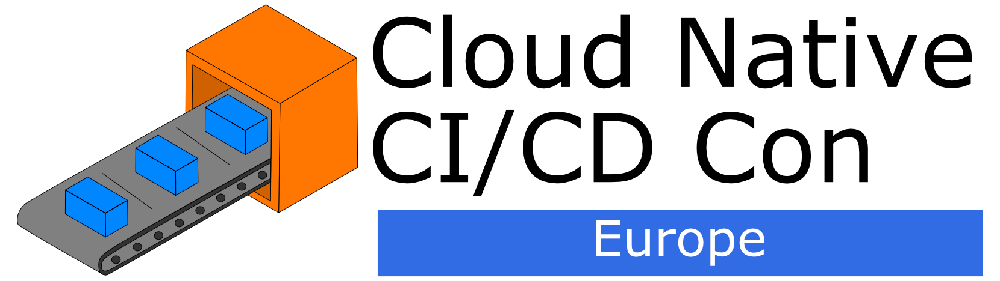
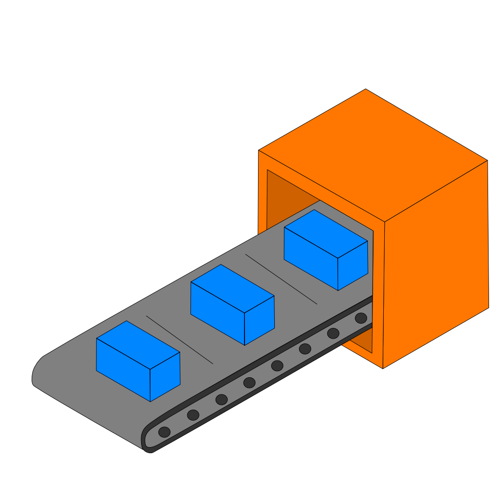

# cicd-colo

## Event Name options

* Cloud Native CI/CD Con
* Release Engineering Day

## Description

Cloud Native CI/CD Con is a one-day conferenced focussed around all things continuous integration, continuous delivery, GitOps, automation and release engineering. The event aims to improve developer experience and productivity when releasing, testing and updating software by leveraging cloud native tools and techniques to develop quickly and reliably. The event is vendor-neutral and based around the various CI/CD and GitOps projects within the CNCF ecosystem.

**Topics covered:**

* Continuous Integration
* Continuous Delivery
* GitOps
* Automation
* Release Engineering

**Event HashTags:** `#CICDCon` / `#RelEngDay`

## Branding

* Hex codes: `#0088FF` and `#FF7700`

**Logos:**

Cloud Native CI/CD Con

Release Engineering Day

Individual Logos

